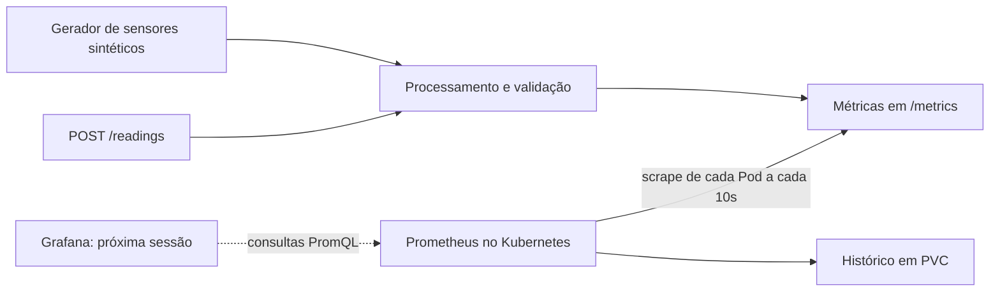

# OAT 2 — roteiro do piloto — 07/10/2026

Problema: **Monitorando a Continuidade**. Equipe: **Macapá**.
Piloto: **Lenilson Soares**. Copiloto: **Joab Nascimento**.
Os demais responsáveis estão no [registro da sessão](registro-sessao-07-10.md),
conforme o caderno enviado pela equipe.

## Entrega desta sessão

O caderno de guias pede, para 07/10, instrumentação do simulador Python e
Prometheus funcional no Kubernetes. Esta implementação acrescenta esses recursos
à infraestrutura Java, MySQL e Redis da OAT 1.

O código-base Python do professor não estava entre os arquivos disponíveis.
Foi criado um simulador de leituras sintéticas de temperatura do motor (°C) e
tensão de bateria (V). Se o professor disponibilizar outra base, preservar as
métricas e adaptar a geração das leituras. As faixas aceitas servem para validar
o exercício; não são limites de diagnóstico de veículos reais.

| Requisito | Arquivos / comprovação |
| --- | --- |
| Python instrumentado | `iot/mecaniqa_iot/`, `/metrics` e testes |
| Prometheus no Kubernetes | `k8s/oat2/`, descoberta de Pods e target UP |
| Brainstorm e board | [Registro da sessão](registro-sessao-07-10.md), decisões do caderno e proposta de board |
| Relatório da sessão | Registro técnico e evidências locais; Douglas Leite revisa a consolidação |
| Versionar na principal | Arquivos preparados localmente; commit e push ainda dependem da equipe |

## 1. Preparar a demonstração

Abra PowerShell na raiz do repositório. É necessário Docker Desktop em Linux
containers, Kubernetes habilitado e `kubectl` com contexto `docker-desktop`.
O cluster precisa oferecer uma StorageClass padrão para o PVC do Prometheus.

```powershell
docker version
kubectl --context docker-desktop get nodes
kubectl --context docker-desktop get storageclass
.\scripts\check-oat2.ps1
.\scripts\start-oat2.ps1
.\scripts\test-oat2.ps1
```

`check-oat2` constrói um ambiente descartável, executa lint, formatação, testes e
validação das configurações. Não exige Python instalado no Windows.
`start-oat2` valida os manifestos no servidor e aplica os recursos no namespace
`mecaniqa`, usando uma tag de imagem única para evitar cache de builds anteriores.
O manifesto aplicado é salvo junto das evidências. `test-oat2` abre túneis temporários, envia leituras, consulta Prometheus
e fecha apenas os túneis que iniciou. O teste acrescenta uma leitura válida e uma
inválida ao histórico sintético. As evidências ficam em `out/oat2-2026-10-07/`.

O teste de recuperação é opcional e reinicia os Pods. Execute-o antes de abrir
os túneis da demonstração, quando precisar verificar persistência e descoberta
com duas réplicas temporárias:

```powershell
.\scripts\test-oat2-recovery.ps1
```

Para recuperar apenas o acesso pelo navegador, reabra o port-forward. Executar
novamente o teste de recuperação não é necessário para esse acesso e pode
interromper os túneis que já estavam ativos.

Em clusters que não compartilham as imagens locais do Docker Desktop, carregar
`mecaniqa-iot:2.0` no runtime ou publicá-la em um registry acessível e ajustar o
manifesto antes de executar o script. Erro `ImagePullBackOff` deve ser investigado
com `kubectl describe pod`, não resolvido removendo dados do cluster.

## 2. Mostrar o funcionamento ao professor

Use três terminais. Os dois primeiros ficam ocupados com os túneis; faça as
requisições no terceiro. Os testes automatizados fecham seus próprios túneis ao
terminar e não deixam as portas 8000/9090 abertas para esta demonstração.

Se os endereços já estiverem acessíveis por túneis ativos, use essa conexão.
Abrir outro port-forward na mesma porta causará um erro de porta ocupada.

Execute o teste de recuperação antes de abrir os túneis: ele substitui Pods e
pode interromper um port-forward que já estava em execução. Se isso acontecer,
execute novamente o comando de port-forward correspondente.

**Terminal 1 — Prometheus:** confira os recursos e abra o túnel.

```powershell
kubectl --context docker-desktop get pods,svc,pvc -n mecaniqa
kubectl --context docker-desktop logs deployment/mecaniqa-iot -n mecaniqa --tail=15
kubectl --context docker-desktop port-forward -n mecaniqa svc/prometheus 9090:9090 --address=127.0.0.1
```

Deixe esse terminal aberto. Aguarde a mensagem `Forwarding from 127.0.0.1:9090`.

Abra `http://127.0.0.1:9090/targets`: o job `mecaniqa-iot` deve estar UP.
Na tela de consulta, execute:

```promql
sum by (result) (mecaniqa_iot_readings_total)
```

**Terminal 2 — simulador IoT:**

```powershell
kubectl --context docker-desktop port-forward -n mecaniqa svc/mecaniqa-iot 8000:8000 --address=127.0.0.1
```

Deixe esse terminal aberto. Aguarde a mensagem `Forwarding from 127.0.0.1:8000`.

**Terminal 3 — requisições:** faça as leituras.

```powershell
Invoke-RestMethod http://127.0.0.1:8000/health
Invoke-RestMethod http://127.0.0.1:8000/readings -Method Post -ContentType application/json -Body '{"sensor_type":"engine_temperature","value":90}'
# O erro HTTP 422 abaixo é esperado: tensão negativa é inválida.
Invoke-RestMethod http://127.0.0.1:8000/readings -Method Post -ContentType application/json -Body '{"sensor_type":"battery_voltage","value":-1}'
```

Espere pelo próximo scrape (intervalo de 10 segundos) e confira os contadores no
Prometheus. Para encerrar o acesso pelo navegador, pressione Ctrl+C nos terminais
de port-forward. Isso não apaga os Pods nem o histórico do PVC.

`422` na leitura negativa é o resultado esperado da validação. Já “conexão
recusada” significa que o acesso local não está disponível: verifique se o túnel
da porta 8000 continua ativo. Nos logs, “Leitura sintética rejeitada” também é
esperado, pois a geração usa probabilidade de erro de 10% para o exercício.

## 3. Explicar a arquitetura



- `domain.py`: regras das leituras, sem dependência de HTTP ou Prometheus.
- `application.py`: processamento e geração; recebe um observador de métricas.
- `metrics.py`: adaptador para Counter, Histogram e Gauge.
- `http.py`: protocolo, tamanho do corpo e respostas HTTP.
- `config.py` e `__main__.py`: configuração e composição dos componentes.

Os comentários explicam decisões que afetam o comportamento. A separação mantém
o domínio testável sem servidor ou cluster, usando apenas uma dependência de
execução externa: `prometheus-client`.

## Métricas e interpretação

| Métrica | Significado |
| --- | --- |
| `mecaniqa_iot_readings_total{result,source}` | Sucesso/erro de validação; origem `http` ou `simulator` |
| `mecaniqa_iot_processing_duration_seconds` | Histograma do tempo de processamento; não inclui latência de rede |
| `mecaniqa_iot_inflight_readings` | Leituras em processamento |
| `mecaniqa_iot_last_reading_value{sensor_type}` | Último valor válido; temperatura em °C e tensão em V |
| `process_cpu_seconds_total` | Tempo acumulado de CPU do processo Python |
| `process_resident_memory_bytes` | Memória residente do processo Python |
| `up{job="mecaniqa-iot"}` | Resultado do scrape do Prometheus |

Os rótulos têm valores limitados; não usar IDs de sensores, oficinas ou texto de
erros como rótulos. O erro contado é de uma leitura recebida como JSON e rejeitada
pelo domínio. JSON malformado, protocolo incorreto e corpo excessivo são rejeitados
antes do processamento e não entram nesse contador. Não confundir essa taxa com
disponibilidade da aplicação ou taxa de falhas HTTP geral.

```promql
# Leituras por segundo, por resultado
sum by (result) (rate(mecaniqa_iot_readings_total[5m]))

# Percentual de leituras inválidas entre as leituras processadas
100 * sum(rate(mecaniqa_iot_readings_total{result="error"}[5m]))
  / clamp_min(sum(rate(mecaniqa_iot_readings_total[5m])), 0.000001)

# CPU em núcleos usados pelo processo; memória em bytes
sum(rate(process_cpu_seconds_total{job="mecaniqa-iot"}[5m]))
sum(process_resident_memory_bytes{job="mecaniqa-iot"})
```

CPU e memória acima descrevem o processo Python, não o uso total dos nós ou de
todos os containers. Para os dashboards de infraestrutura da próxima sessão,
definir com o arquiteto a coleta dos recursos de containers/nós. Para HPA, verificar
a API de métricas do Kubernetes e os requests; o endpoint Python não a substitui.

## Configuração e operação local

| Variável | Padrão | Regra |
| --- | --- | --- |
| `PORT` | `8000` | 1 a 65535 |
| `SIMULATION_INTERVAL_SECONDS` | `1` | 0 desliga geração; demais valores >= 0,05 |
| `SIMULATION_ERROR_RATE` | `0.1` | Probabilidade por leitura entre 0 e 1 |
| `SIMULATION_SEED` | `42` | Inteiro para reproduzir a sequência sintética |

A taxa 0,1 é uma configuração didática, não uma medição de falhas da MecâniQA.
O gerador e HTTP usam o mesmo processamento e as mesmas métricas. As leituras
brutas não são gravadas no MySQL/Redis; o Prometheus guarda as séries temporais.
As métricas do processo reiniciam com o Pod; `rate` trata resets de contadores.

Como alternativa para desenvolver sem Kubernetes:

```powershell
docker compose -p mecaniqa-oat2 -f docker-compose.oat2.yml up -d --build
.\scripts\test-oat2.ps1 -Mode Compose
docker compose -p mecaniqa-oat2 -f docker-compose.oat2.yml ps
```

Não use Compose e port-forward nas mesmas portas ao mesmo tempo. Para parar o
Compose preservando o volume: `docker compose -p mecaniqa-oat2 -f docker-compose.oat2.yml down`.
O Kubernetes usa Services internos; acesso local via port-forward. A API de leitura
não possui autenticação e é destinada ao laboratório. Não expor publicamente sem
definir autenticação, limites de tráfego e transporte seguro.

## Fala breve do piloto

“Hoje acrescentamos observabilidade à base da OAT 1. O simulador produz leituras
de temperatura e tensão e também recebe leituras por HTTP. O processamento valida
os dados e registra sucesso, erro e duração. O Prometheus consulta o endpoint de
métricas de cada Pod e guarda o histórico em um volume persistente. Aqui mostramos
o target UP, uma leitura aceita, outra rejeitada e os dois resultados na consulta.
Na próxima sessão, o Grafana usará o Prometheus como fonte para os dashboards.”

## Próximas entregas do caderno

- 14/10: datasource Grafana e quatro dashboards exportados/versionados.
- 21/10: quatro alertas (CPU, memória e dois personalizados), HPA e teste de carga
  com evidências.
- Encerramento: runbooks e plano de continuidade com SLA, SLO, SLI, RTO e RPO.
  O caderno repete 21/10 no último encontro; confirmar essa data com o professor.
- Entrega final da OAT 2: apresentação e submissão previstas no enunciado.

Esta primeira entrega não comprova SLA 99,9%, comportamento em produção ou
escalabilidade sob carga massiva. Essas conclusões exigem as próximas medições.

## Referências técnicas

- [Cliente Python do Prometheus](https://prometheus.github.io/client_python/)
- [Configuração e descoberta Kubernetes](https://prometheus.io/docs/prometheus/latest/configuration/configuration/)
- [Consultas PromQL](https://prometheus.io/docs/prometheus/latest/querying/basics/)

Requisitos acadêmicos conferidos no PDF da OAT 2 e no caderno de guias fornecidos
pela equipe; este roteiro cobre a atividade de 07/10.
